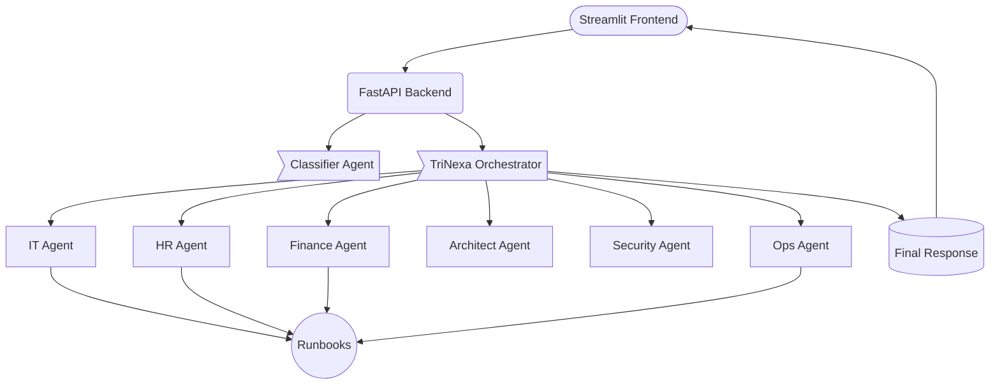

# 🚀 TriResolve AI – Multi-Agent Service Desk Platform

A next‑generation, Azure‑powered, **multi‑agent orchestration system** designed to automate IT, HR, Finance, and operational workflows using structured agents, deterministic runbooks, and intelligent routing.

Built collaboratively by the **TriResolve AI Team** for the 2025 AI Engineering Hackathon.

---

# 🌟 Key Features
- 🤖 **Multi-Agent Intelligence** across IT, HR, Finance, Ops, Security, and Architecture domains
- 🧭 **TriNexa Orchestrator** for multi-agent coordination and final answer synthesis
- 🧠 **Classifier Agent** for ticket domain + intent prediction
- 📘 **Deterministic YAML Runbooks** for consistent, auditable workflows
- ⚡ **FastAPI Backend** with Azure OpenAI integration
- 🔍 **Observability & Logging** for agent calls and orchestration traces
- 📊 **Streamlit Frontend** for visual demo + interactive UX
- 🐳 **Docker-ready** for reproducible deployment

---

# 🧠 System Architecture Overview
The TriResolve AI platform is built using a layered architecture:



---

# 🧩 System Components

## 🛰 1. **FastAPI Backend**
Handles:
- Ticket intake and validation
- Communication with Azure OpenAI agents
- TriNexa Orchestrator routing logic
- Response standardization

---

## 🧠 2. **Azure AI Foundry Multi-Agent Layer**
Each agent is defined with:
- Instructions (persona + rules)
- Input + Output schemas
- Optional tools (KB search, runbooks, etc.)

### Domain Agents:
- **IT Agent** – device + access troubleshooting
- **HR Agent** – onboarding + employee policies
- **Finance Agent** – invoices, vendor, reimbursements
- **Security Agent** – risk review + compliance rules
- **Ops Agent** – SRE-style incident triage
- **Architect Agent** – system design + solution planning

### System Agents:
- **Classifier** – domain + intent prediction
- **TriNexa Orchestrator** – multi-agent routing + final answer synthesis

---

## 📜 3. Runbooks
Stored under `/agents/<domain>/runbooks/`.

YAML-based deterministic actions that agents reference to:
- Structure multi-step processes
- Maintain auditability
- Prevent inconsistent behavior

---

## 🎨 4. Streamlit UI
Intuitive interface for demo and judging:
- Map page for agent architecture visualization
- Assistant page for real-time interactions
- Color‑coded departmental themes
- Runs locally or via Streamlit Cloud

---

# 🔧 Tools & Technologies
TriResolve AI is built with:

### **Languages & Frameworks**
- Python 3.11+
- FastAPI
- Streamlit

### **AI & Orchestration**
- **Azure OpenAI** (multi-agent deployments)
- **Azure AI Foundry** (agent instructions + schemas)
- **Azure Cognitive Search** (optional KB integration)

### **Infra & DevOps**
- Docker
- GitHub Actions
- `.env` + GitHub Secrets

### **Data**
- Synthetic ticket datasets (IT/HR/Finance)
- Foundry metadata for agents
- YAML runbooks

---

# 📁 Project Structure

```text
triresolve-service-desk/
├── agents/
│   ├── it/
│   ├── hr/
│   ├── finance/
│   ├── security/
│   ├── ops/
│   ├── architect/
│   └── orchestrator/
│
├── backend/
│   ├── api/
│   ├── services/
│   ├── schemas.py
│   ├── azure_client.py
│   └── orchestrator.py
│
├── streamlit/
│   ├── streamlit_app.py
│   └── pages/
│
├── docs/
├── runbooks/
├── .env.example
├── Dockerfile
└── requirements.txt
```

---

# 🧪 Local Development
### Run the Backend
```bash
uvicorn backend.api.main:app --reload
```

### Run Streamlit
```bash
streamlit run streamlit/streamlit_app.py
```

### Docker
```bash
docker build -t triresolve-ai .
docker run -p 8000:8000 triresolve-ai
```

API docs available at:
```
http://localhost:8000/docs
```

---

# 🛡️ Responsible AI & Safety
TriResolve AI was developed using strong Responsible AI principles to ensure safety, security, compliance, and ethical automation.

### ✔ Privacy & Security by Design
- Zero real user data used; 100% synthetic datasets
- Secrets isolated in `.env` and GitHub Secrets
- Azure RBAC enforced across OpenAI and Foundry resources
- Logs avoid collecting PII and redact sensitive content

### ✔ Agent Guardrails
- Domain-specific allow/deny lists embedded in each agent
- Orchestrator enforces safe multi-agent routing
- Security Agent evaluates identity, access, and compliance risks
- Finance, HR, and IT agents strictly follow policy-aligned boundaries

### ✔ Explainability & Transparency
- Orchestration logs show exactly which agents were called
- Deterministic YAML runbooks create consistent, auditable outcomes
- Each agent returns structured fields for full traceability

### ✔ Ethical Automation
- Designed to augment—not replace—human decision-making
- Automated actions include built-in escalation pathways
- Security, Ops, and HR agents elevate risk-sensitive requests to humans

### ✔ Dataset Responsibility
- No private or organizational datasets used
- Synthetic tickets generated for IT, HR, and Finance
- Dataset bias manually checked and minimized

---

# 🏆 Hackathon Deliverables
TriResolve AI demonstrates:
- Fully working **multi-agent orchestration**
- JSON-standardized outputs
- Structured runbook-driven automation
- Full audit + reasoning trace through TriNexa
- A polished end-to-end UX

### Milestones
- **M1** – Foundations
- **M2** – Agents + Backend Routing
- **M3** – Classifier Integration
- **M4** – Demo UX + Streamlit
- **M5** – End-to-End System Demo
- **M6** – Final Submission

---

# 👥 Team TriResolve AI
A globally distributed engineering team:

### 🇺🇸 **Portia Jefferson**
Lead Architect & AI Systems Designer

### 🇵🇪 **Esthefany Humpire Vargas**
Backend Developer & Data Engineer

### 🇬🇧 **Nithya Kumar**
Machine Learning Engineer

### 🇺🇸 **Megan Nepshinsky**
UX Contributor & Logic Reviewer

---

# 💡 About the Creators
TriResolve AI was created through collaborative engineering, multi‑agent experimentation, and cross‑domain product design by the TriResolve team.

The system is designed for extensibility, auditability, and real-world enterprise service desk automation.
