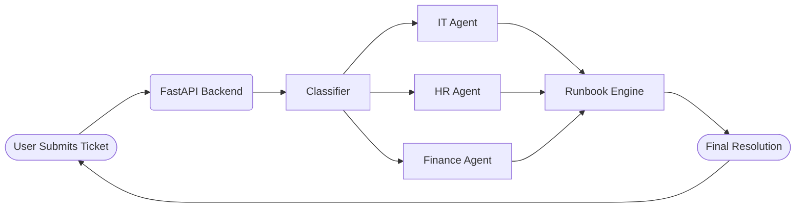

# 🚀 TriResolve AI – Multi-Agent Service Desk Orchestrator

Created by **Portia Jefferson — aka Portia Mariee (Cyb3rBombsh3ll)**  
AI-Augmented Hackathon Project • 2025

---

## 🌟 Key Features
- 🤖 Multi-Agent Intelligence (IT, HR, Finance)
- ⚡ Automatic ticket classification & routing
- 📘 Deterministic YAML runbook execution
- 🧠 Retrieval-augmented reasoning
- 🐳 Docker-ready FastAPI backend
- 📊 Transparent logs, decision traces & reproducibility
- 🧪 Synthetic datasets powering training & testing

---

## 🧠 Architecture Overview



---

## 🧩 System Components

### 🛰 1. FastAPI Backend
Central hub for:
- Ticket intake  
- Domain classification  
- Agent routing  
- Runbook execution  
- Response formatting  

---

### 🧠 2. Agent Layer (Azure AI Multi-Agents)

Each agent features:
- Domain logic  
- YAML runbook execution  
- SOP & policy retrieval  
- Python tool-calling  

#### IT Agent
- Password reset  
- VPN troubleshooting  
- Device triage  
- Lockout issues  

#### HR Agent
- PTO & benefits  
- Policy lookup  
- Onboarding support  

#### Finance Agent
- Payroll adjustments  
- Reimbursements  
- Invoice/Budget issues  

---

### 📜 3. Runbooks (Deterministic Automation)

Example:

```yaml
action: password_reset
steps:
	- validate_user_identity
	- check_AD_lockout_status
	- reset_password
	- notify_user: "Your password has been reset."
```

---

### 🧪 4. Synthetic Datasets

Used for classifier training, agent prompts & testing.

Sources:
- HuggingFace IT helpdesk dataset  
- Kaggle HR datasets  
- Kaggle Finance datasets  

---

## 🔄 High-Level Ticket Lifecycle

```
User → Backend → Classifier → Agent (IT/HR/Finance)
		 → Runbook Execution → Resolution → User
```

---

## 📁 Project Structure

```
backend/
	main.py
	api/
		routes.py
	agents/
		it_agent.py
		hr_agent.py
		finance_agent.py

runbooks/
	it/
	hr/
	finance/

docs/
	architecture.md

requirements.txt
Dockerfile
```

---

## 🐳 Development & Deployment

### Local Development  
```bash
pip install -r requirements.txt
uvicorn backend.main:app --reload
```

### Docker Run  
```bash
docker build -t triresolve-ai .
docker run -p 8000:8000 triresolve-ai
```

### API Docs  
Visit:
```
http://localhost:8000/docs
```

---

## 🏆 Hackathon Deliverables

TriResolve AI demonstrates:
- Working multi-agent auto-resolution  
- Accurate triage & classification  
- Deterministic runbook workflows  
- Reproducible ticket resolution demos  
- Clear explainability for judges  

---

## 🫂 Team TriResolve AI

🫂 Team TriResolve AI

A globally distributed, AI-powered hackathon team collaborating across three countries.

┌─────────────────────────────────────────┐
│          🌍  TEAM TRIREESOLVE AI        │
│    Innovators • Engineers • Builders     │
└─────────────────────────────────────────┘

👑 Portia Jefferson — aka Portia Mariee (Cyb3rBombsh3ll)

🇺🇸 United States
Role: Lead Architect • AI Systems Designer • Backend Integrations
🧠 Specialty: Multi-agent reasoning, runbooks, system orchestration
GitHub: https://github.com/portiajefferson

LinkedIn: https://www.linkedin.com/in/portiajefferson

🧩 Esthefany Humpire Vargas

🇵🇪 Peru
Role: Machine Learning Engineer • Classifier + Dataset Integration
🧠 Specialty: Dataset structuring, ML modeling, signal mapping
GitHub: https://github.com/steffahv

LinkedIn: https://www.linkedin.com/in/ehuvarg/

🔧 Nithya Kumar

🇬🇧 United Kingdom
Role: Agent Logic Specialist • Runbook + SOP Mapping
🧠 Specialty: Agent reasoning flows, deterministic logic, workflows
GitHub: https://github.com/Nithyananthisenthilkumar

LinkedIn: https://www.linkedin.com/in/nithyananthi-senthilkumar

🌟 Megan Nepshinsky

🇺🇸 United States
Role: Contributor • UX & Workflow Reviewer
🧠 Specialty: Logic clarity, QA flow, user experience analysis
GitHub: https://github.com/megan-nepshinsky

LinkedIn: https://www.linkedin.com/in/megan-marie-janish/


## 💜 About the Creator  
Built by **Portia Jefferson**  
Cybersecurity • AI • Automation • Creative Intelligence  

---

